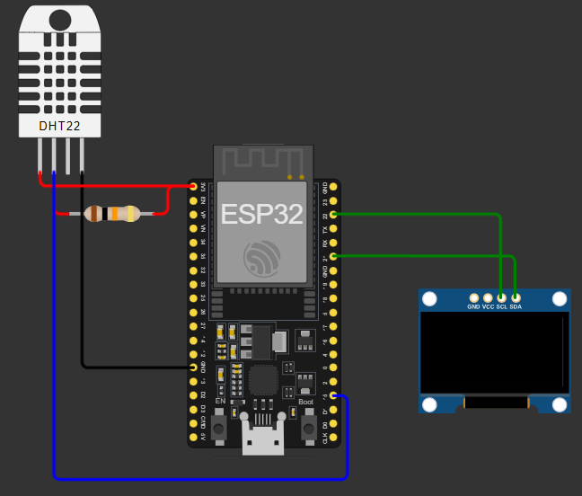
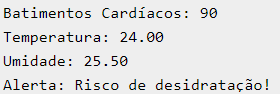
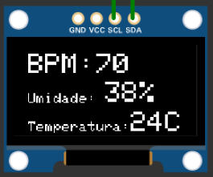
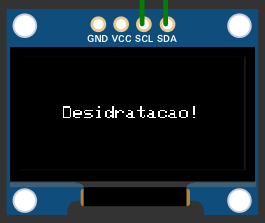

# Sprint 3 - Capacete Inteligente

Integrantes   | RM
--------- | ------
Camila Pedroza da Cunha | RM 558768
Diógenes Henrique dos Santos Costa | RM 559127 
Isabelle Dallabeneta Carlesso | RM 554592
Nicoli Amy Kassa | RM 559104
Pedro Almeida Camacho | RM 556831

### Descrição do Projeto
> Esse projeto utiliza o ESP32 e outros componentes para monitorar as condições do piloto. O sistema é capaz de medir a temperatura e umidade interna do capacete, além dos batimentos cardíacos e sinais de desidratação. Com esse projeto é possível garantir a segurança e o bem-estar dos pilotos. 

### Equipamentos utilizados
* ESP32;
* Jumpers;
* Sensor de temperatura e umidade (DHT22);
* Display OLED SSD1306;
* Resistor;

### Montagem do Hardware

## Resultados
> Após o sistema ser implementado. Deve ser apresentado as seguintes informações:

* BPM (Batimento Por Minuto);
* Umidade;
    * Caso a ummidade seja menor que 30% terá um aviso de desidratação;
* Temperatura;

### Monitor serial: 

### Display OLED:

# Servidor IoT MQTT

Neste projeto utilizando a rede Cloud da Azure para conectar nosso esp32 a servidores na nuvem, criamos uma maquina virtual linux.

Alem disso o servidor foi feito utilizando docker e fiware do repositorio fiware descomplicado assim conseguimos rodar e processar as informações e dados gerador pelo esp no servido dedicado a isso,
na imagem vemos o nosso device200 utilizado na simulação conectado ao servidor.

# Observações
>Essa é apenas uma simulação. O projeto principal utilizaria um sensor de batimentos cardíacos, como o sensor MAX30100, porém como não há esse componente na biblioteca do simulador, utilizamos uma variável que gera números aleatórios entre 60 e 100. Além disso, o projeto inicial contava com a aplicação do sensor de condutividade elétrica para identificar sinais de desidratação, porém na simulação utilizamos a própria medição de umidade do DHT22. E para possíveis melhorias, poderia ser incrementado um acelerômetro e giroscópio, como o MPU6050, para monitorar os movimentos do capacete e detectar possíveis impactos ou quedas.

## Objetivos 
>O capacete inteligente tem como objetivo principal aumentar a segurança, conforto e eficiência durante as corridas, monitorando sinais vitais como frequência cardíaca e temperatura corporal para detectar condições críticas, como por exemplo a desidratação. Caso seja equipado com sensores que detectam quedas ou impactos, o capacete pode enviar alertas automáticos para equipes de resgate em caso de acidentes. Além disso, a tecnologia permite a integração com dispositivos móveis, facilitando a comunicação e a recepção de informações importantes, enquanto coleta dados sobre a performance do piloto para análise e melhoria contínua, garantindo o bem-estar do piloto em todas as situações. 

# Links
#### [Simulação do projeto](https://wokwi.com/projects/409829036145276929)

#### [Vídeo explicativo do projeto](https://youtu.be/GU1-X_vgeWk)

#### [Código Fonte em C++](https://github.com/Nicoli-Kassa/EDGE_SPRINT2/blob/main/codigo.c%2B%2B)

